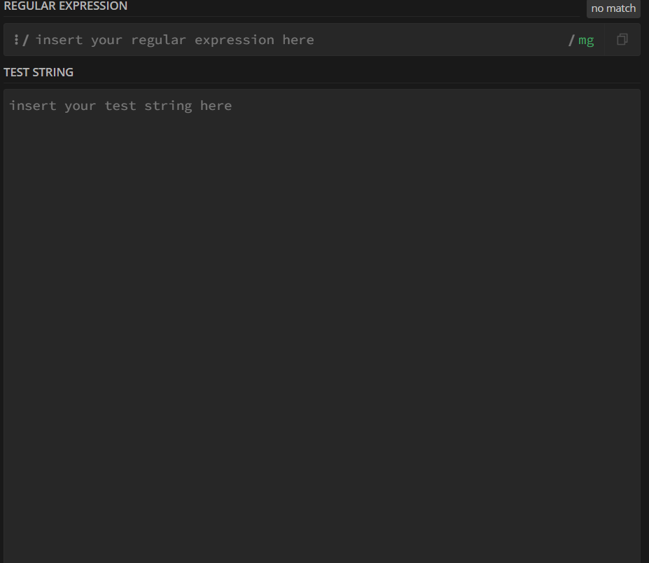
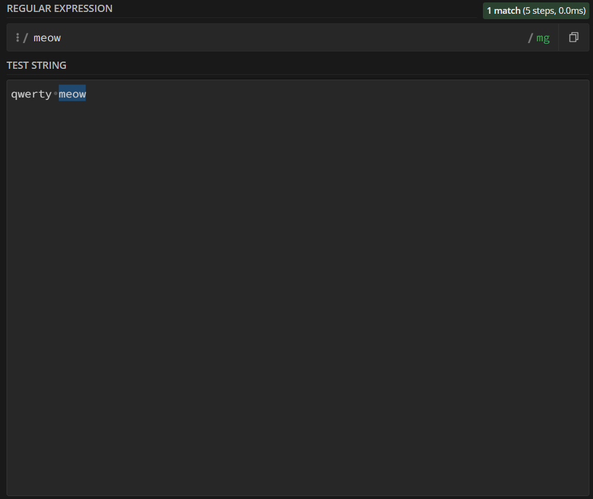
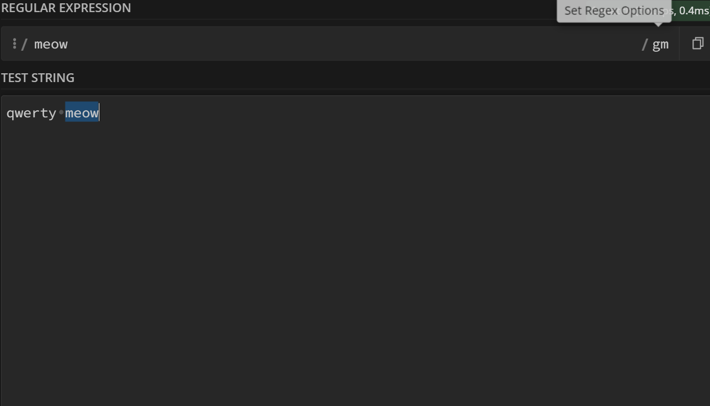
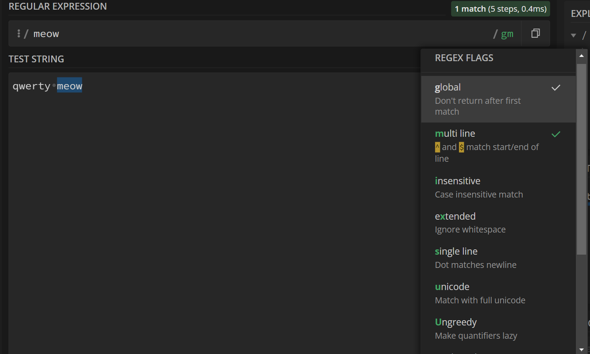
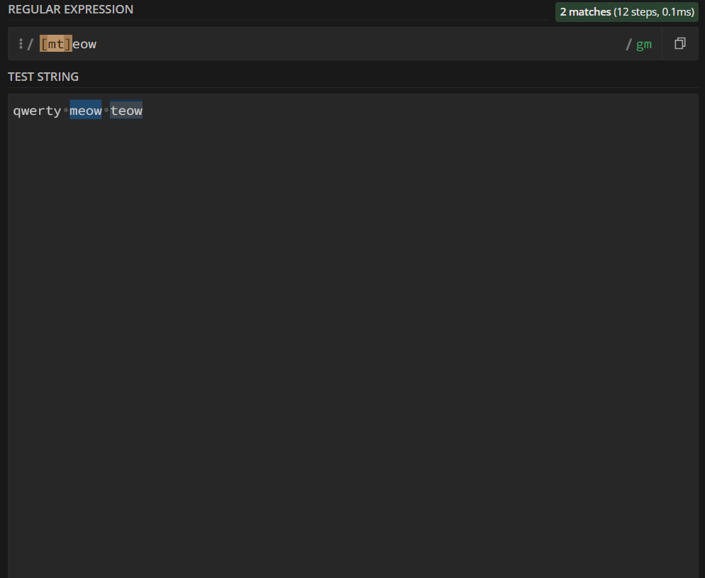
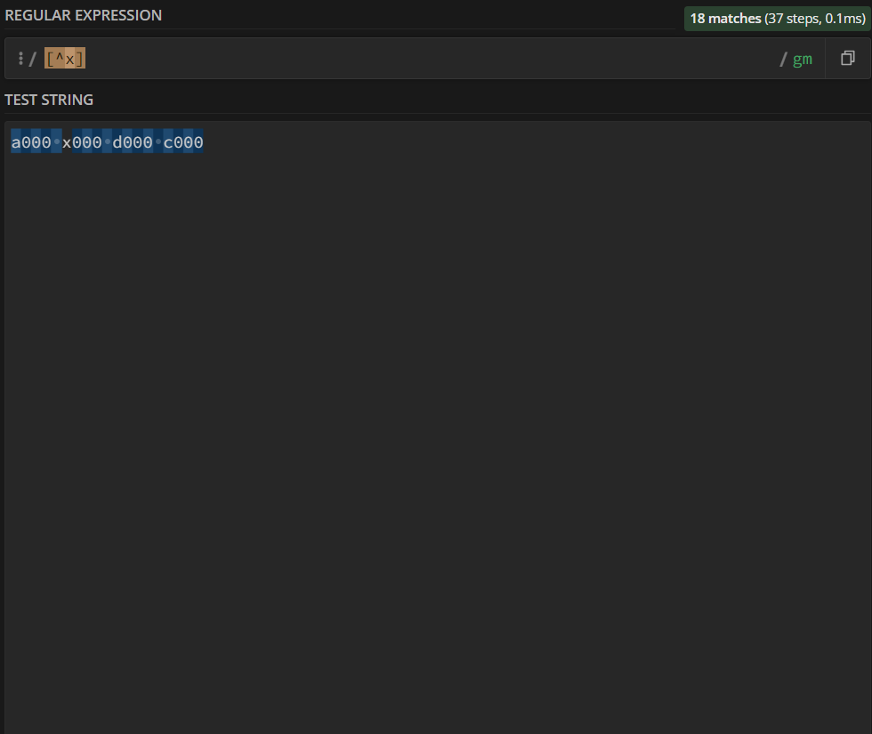

### 01 - 02

https://regex101.com/ 

когда вы пишете в большой ячейке это текст

а когда в малой это место для регулярный вырожений и того текста который вы хотите найти в своей большой ячейке

пример

вы пишете в тексте 
- qwerty meow

а в малой ячейке meow 

то тогда выделяется Meow

если вы напишете meow несколько раз подряд то тогда все meow выделется

если вам нужно что бы только первый meow из всех то тогда надо нажать на set regex options

и нажать (снять галку) с global

### 03 - 04

вы можете поставить квадратные скобки [] в молой ячейке и вних написать первую букву

также можно укозать много букв в скобках

пример (у вас галка на global)

- qwerty teow meow meow в тексте
- [mt]eow в малой ячейке

есле вы хотите выделить весь алфавит кроме буквы x вы не должны писать весь алфовит кроме буквы x

вы можете написать только ^ и x чтобы не выделять букву x

есле вы хотите чтобы все буквы от a до f были выделены вы должны написать в скобках a - z

представим что человеку нужно ввести номер телефон из 11 цивр

тогда ставим 11 раз [0-9] и будут учитоватся только 11 цивр и всё

оптимизировать код можно написать [0-9]{11}

придставим ситуацию что нам надо указать пароль из пяти букв

тогда [a-z]{5}

